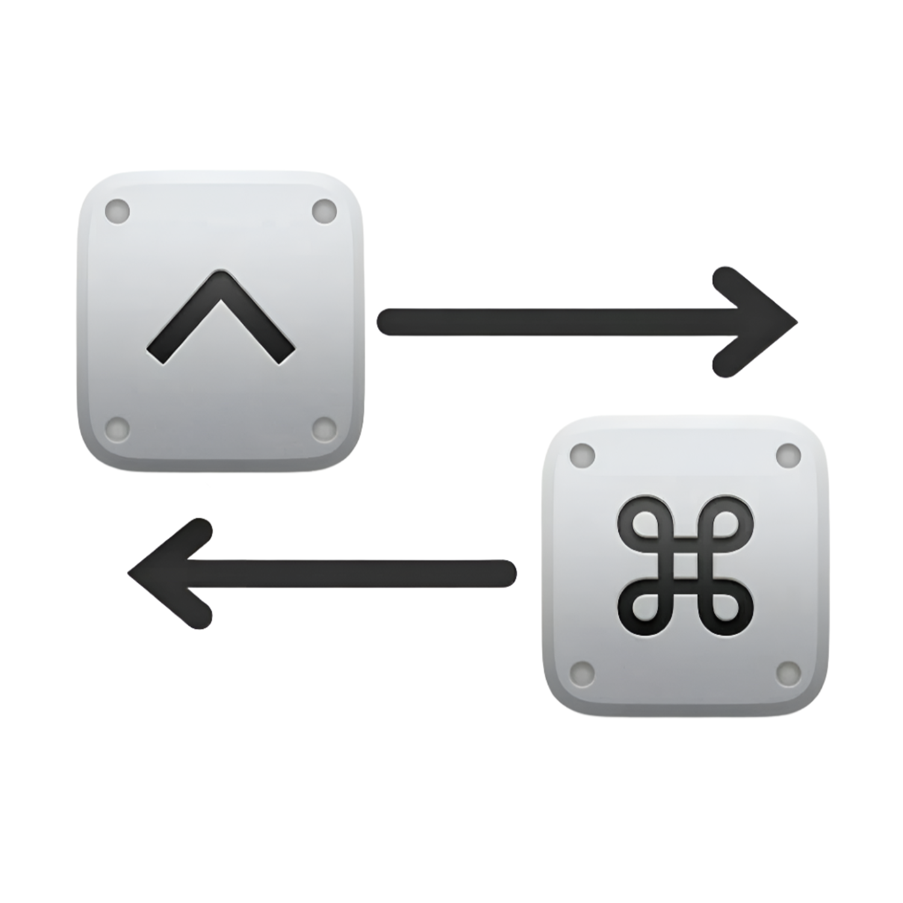
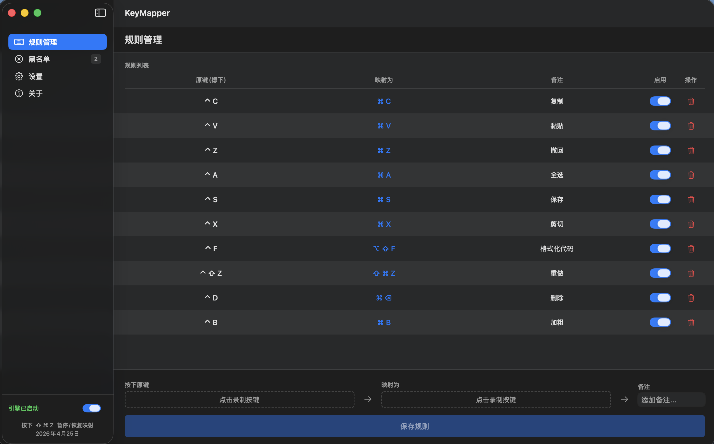
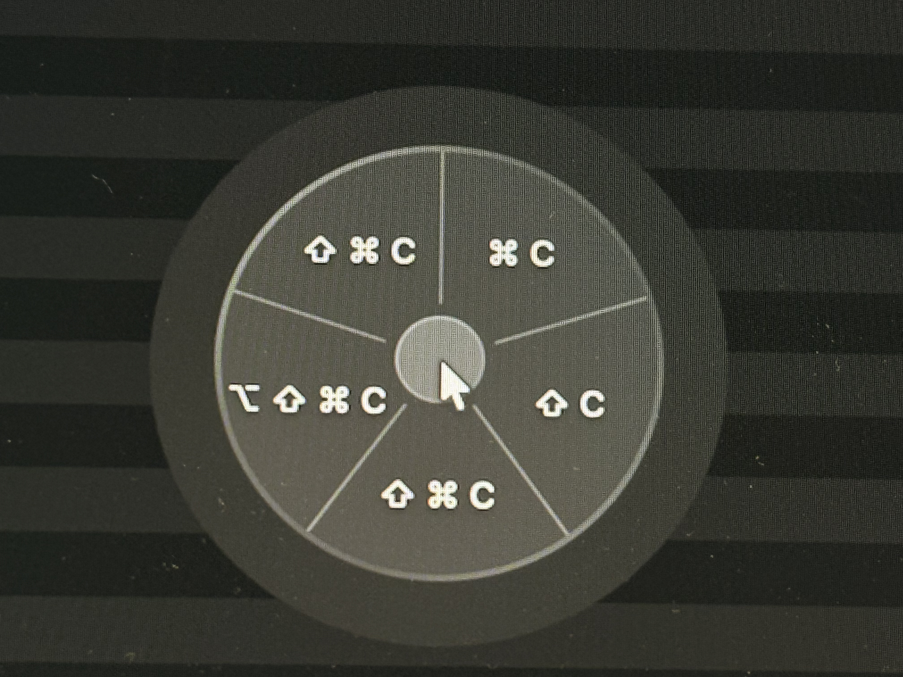

# KeyMapper for macOS

  

  <b>A lightweight macOS key remapping tool for Mac users</b> 
  <b>轻量级 macOS 按键映射工具，专为 Mac 用户打造</b>

  <a href="#english-version">English</a> | <a href="#中文版本">中文</a>

---

  

---

## English Version

### 🎯 What is KeyMapper?

KeyMapper is a lightweight macOS app designed for Windows users who struggle with macOS keyboard shortcuts. After years of using `Ctrl+C/V`, switching to `Command+C/V` can be frustrating. KeyMapper solves this by mapping Windows-style shortcuts to macOS equivalents **without** breaking other Command-based shortcuts.

### ✨ Features

- **🌍 Global Interception**: Uses low-level `CGEventTap` for system-wide key remapping
- **🎬 Visual Recording**: No need to look up keycodes—just click "Record" and press your desired key
- **⌨️ Modifier Support**: Full support for `⌘ Command`, `⌥ Option`, `⇧ Shift`, and `⌃ Control` combinations
- **🎡 Radial Wheel**: When a key has multiple mappings, a beautiful radial wheel appears for quick selection
- **⏯️ Pause Hotkey**: Global hotkey (default: `⇧⌘Z`) to instantly pause/resume the engine
- **📊 Status Feedback**: Status bar icon dims when engine is paused for visual feedback
- **🚫 App Blacklist**: Disable key mapping in specific applications (e.g., Terminal)
- **🎭 Stealth Mode**: Hide Dock icon and enable "Launch at Login" for seamless background operation
- **🔄 Import/Export**: Backup and restore your mapping rules with JSON files
- **🔍 Check for Updates**: Built-in update checker via GitHub Releases
- **🔒 Privacy First**: 100% open-source, no analytics, no network access

### 🎡 Radial Wheel

When you have multiple mappings for the same key combination, KeyMapper shows a beautiful radial wheel selector:

  

- **Instant Selection**: Hold the key, move mouse to select, release to execute
- **Liquid Glass Effect**: Beautiful translucent glass effect on macOS 26+
- **Quick Animation**: Fast spring animation for responsive feel
- **ESC to Cancel**: Press ESC to dismiss without executing any mapping

### 🚀 Getting Started

#### Requirements
- macOS 13.5 or later
- Apple Silicon or Intel Mac

#### Installation

1. **Download**: Grab the latest release from the [Releases](../../releases) page
2. **Install**: Move `KeyMapper.app` to your `Applications` folder
3. **Grant Permissions** (Required):
   - Go to **System Settings > Privacy & Security > Accessibility**
   - Toggle **KeyMapper** to **ON**
   - This permission is required for the engine to intercept keystrokes
4. **First Run**: If macOS warns about an "unverified developer," right-click the app and select **Open**

#### Usage

1. **Create a Mapping**:
   - Click "Press Original Key" and press the key you want to remap (e.g., `Ctrl`)
   - Click "Map To" and press the target key (e.g., `Command`)
   - Click "Save Rule"

2. **Multiple Mappings**:
   - Create multiple mappings for the same key (e.g., `Ctrl+C` → `Command+C` and `Ctrl+C` → `Option+C`)
   - When you press and hold the key, a radial wheel appears
   - Move your mouse to select the desired mapping
   - Release to execute

3. **Pause/Resume Engine**:
   - Use the global hotkey `⇧⌘Z` (Shift+Command+Z) to toggle
   - Or click the status bar icon and select Pause/Resume

4. **Manage Blacklist**:
   - Go to Blacklist page
   - Add apps where you want to disable key mapping

5. **Backup & Restore**:
   - Go to Settings page
   - Click "Export Mapping Rules" to backup
   - Click "Import Config" to restore

### 🛠 Technical Details

- **Architecture**: SwiftUI + AppKit hybrid
- **Event Interception**: CoreGraphics `CGEventTap` API
- **Storage**: UserDefaults + JSON serialization
- **Sandboxing**: Distributed without Sandbox (required for global event interception)

---

## 中文版本

### 🎯 KeyMapper 是什么？

KeyMapper 是一款专为 Windows 用户设计的轻量级 macOS 按键映射工具。用惯了 `Ctrl+C/V` 的用户，切换到 Mac 的 `Command+C/V` 总是不太顺手。使用 KeyMapper 可以地将 Windows 风格的快捷键映射到 macOS 等效快捷键，**同时不影响**其他基于 Command 的快捷键使用。

### ✨ 功能特性

- **🌍 全局拦截**：利用底层 `CGEventTap` 技术，实现系统级按键重映射
- **🎬 可视化录制**：无需记忆键位码，点击录制按钮后直接敲击键盘即可自动识别
- **⌨️ 组合键支持**：完美支持 `⌘ Command`、`⌥ Option`、`⇧ Shift`、`⌃ Control` 的任意组合
- **🎡 轮转转盘**：同一按键有多个映射时，弹出精美轮盘供快速选择
- **⏯️ 暂停快捷键**：全局快捷键（默认：`⇧⌘Z`）快速暂停/恢复引擎
- **📊 状态反馈**：引擎暂停时状态栏图标变淡，直观显示当前状态
- **🚫 应用黑名单**：在特定应用中禁用按键映射（如终端）
- **🎭 静默运行**：支持隐藏 Dock 图标、开机自启动，满足无感化后台运行需求
- **🔄 导入导出**：支持备份和恢复映射规则
- **🔍 检查更新**：内置更新检查功能
- **🔒 完全开源**：不包含任何统计或网络模块，纯净安全，保护输入隐私

### 🎡 轮转转盘

当同一按键组合有多个映射时，KeyMapper 会显示一个精美的轮转转盘选择器：

  

- **即时选择**：按住按键，移动鼠标选择，松手执行
- **液态玻璃效果**：macOS 26+ 上呈现精美的半透明玻璃效果
- **快速动画**：流畅的弹性动画，响应迅速
- **ESC 取消**：按 ESC 键可取消本次操作

### 🚀 快速开始

#### 系统要求
- macOS 13.5 或更高版本
- Apple Silicon 或 Intel Mac

#### 安装步骤

1. **下载**：在 [Releases](../../releases) 页面下载最新版本
2. **安装**：将 `KeyMapper.app` 拖入「应用程序」文件夹
3. **授权**（必须）：
   - 打开「系统设置 > 隐私与安全性 > 辅助功能」
   - 找到 `KeyMapper` 并打开开关
   - 此权限是引擎捕获和修改按键信号的必要条件
4. **首次运行**：由于未经过 Apple 公证，首次运行请**右键点击**图标并选择「打开」

#### 使用方法

1. **创建映射规则**：
   - 点击「按下原键」，按下想要映射的键（如 `Ctrl`）
   - 点击「映射为」，按下目标键（如 `Command`）
   - 点击「保存规则」

2. **多映射选择**：
   - 为同一按键创建多个映射（如 `Ctrl+C` → `Command+C` 和 `Ctrl+C` → `Option+C`）
   - 按住按键时，轮转转盘会弹出
   - 移动鼠标选择想要的映射
   - 松手执行

3. **暂停/恢复引擎**：
   - 使用全局快捷键 `⇧⌘Z`（Shift+Command+Z）切换
   - 或点击状态栏图标，选择暂停/恢复

4. **管理黑名单**：
   - 进入黑名单页面
   - 添加不想启用映射的应用

5. **备份与恢复**：
   - 进入设置页面
   - 点击「导出映射规则」进行备份
   - 点击「导入配置」进行恢复

### 🛠 技术细节

- **架构**：SwiftUI + AppKit 混合
- **事件拦截**：CoreGraphics `CGEventTap` API
- **数据存储**：UserDefaults + JSON 序列化
- **沙盒**：非沙盒模式分发（全局事件拦截必需）

---

## 📄 License

MIT License - See [LICENSE](LICENSE) for details.

## 📝 Changelog

See [CHANGELOG.md](other/CHANGELOG.md) for release history.
